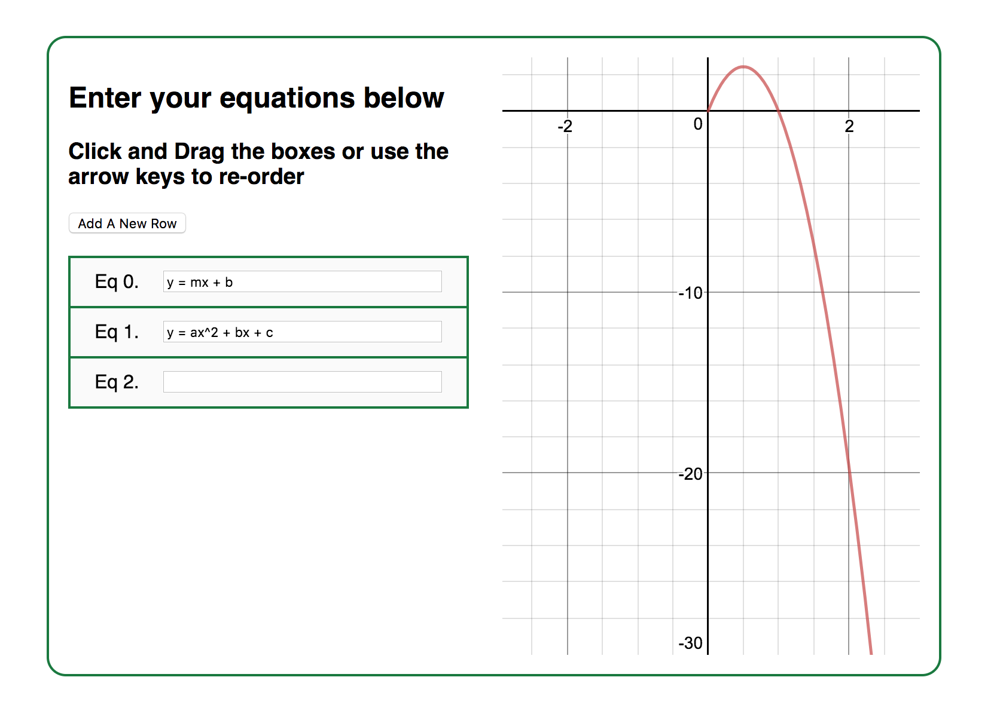

# Drag And Drop Example

This project was an example app while applying for a job. It allows you to enter text into a series of input fields and then re-order the fields by dragging and dropping.

 ### Additional Features:
1. Accessibility: the up and down arrow keys can be used in order to make it more accessible to visually impaired users.
2. Desmos API integration: Equations will be faithfully plotted, as long as valid latex strings are entered.

## See it live

The app is deployed live at [www.speal.ca/drag-and-drop](http://www.speal.ca/drag-and-drop).

## Run it locally

1. Make sure you have node installed: `node --version`, otherwise [install it](https://nodejs.org/).
1. Clone this repo and then CD into it
1. Install dependencies: `npm install`
1. Serve the app: `npm run start`
1. Open your browser to `localhost:3000`

In order to build and deploy the app, run `npm run build` and then `npm run deploy`.

## Inspecting the code

Most of the core logic lives in `src/Column.js`. This component started out only being a column of rows, but has grown in scope to include instructions and the Desmos calculator. With more time, I'd refactor this structure such that the equations are all stored in a parent component, and the Columns component would only be responsible for rendering these equations in a user-configurable order. Beyond the hygienic benefit of separation of concerns, this would also be a good idea because then the data passed to the Calculator component would not change as the presentational order is configured.
